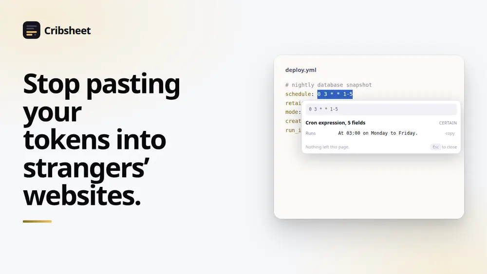
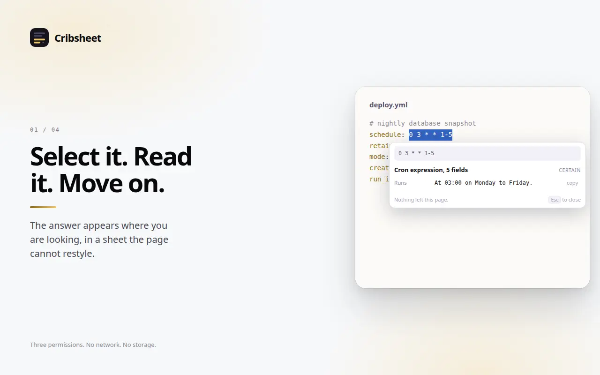
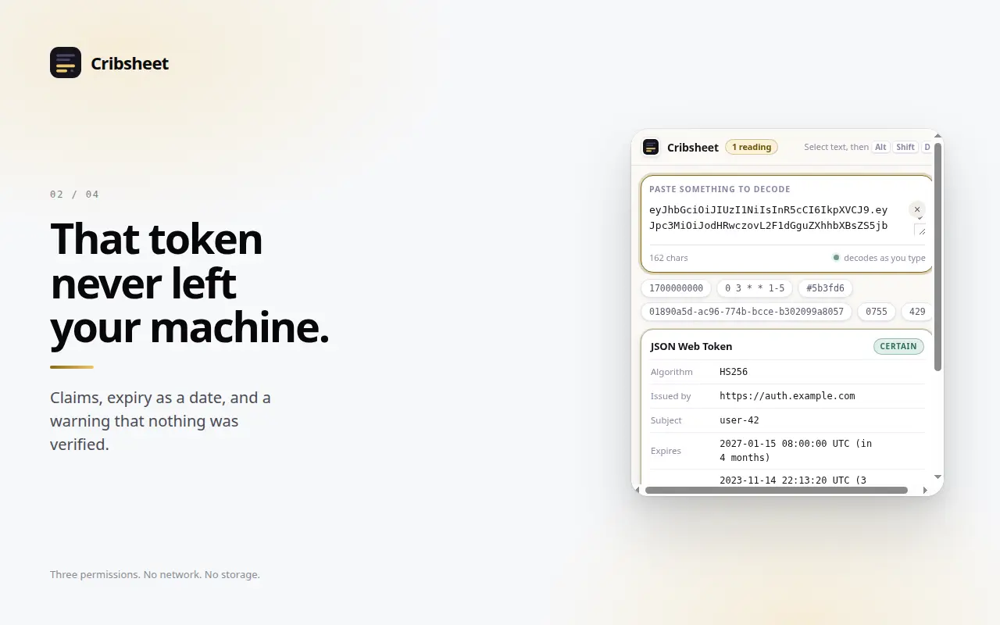
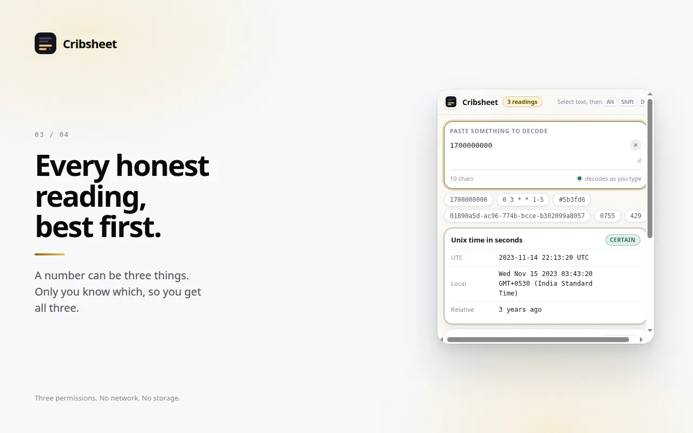
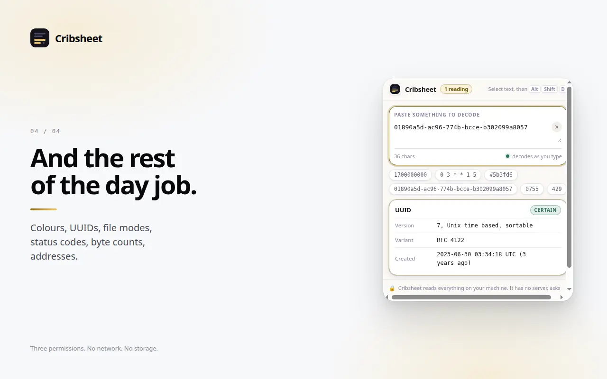

# Cribsheet

Select a timestamp, a cron line, a token, a hash, a hex colour, an octal file
mode. Cribsheet tells you what it means, right there in the page.

The point is not that it saves you a tab. It is that the tab you would have
opened belongs to somebody else.

[](https://github.com/royalpinto007/Cribsheet/actions/workflows/ci.yml)
[](LICENSE)
[](manifest.json)
[](#how-it-works)

<!-- media:start -->

<p align="center">
  
</p>

<h3 align="center">Stop pasting your tokens into strangers’ websites.</h3>

<p align="center">
  <a href="docs/media/demo.mp4">
    
  </a>
  <br>
  <a href="docs/media/demo.mp4"><b>Watch the 30 second demo</b></a>
</p>

## Screenshots



<sub>Select it. Read it. Move on.</sub>

<details>
<summary><b>See 3 more</b></summary>

### Jwt



<sub>That token never left your machine.</sub>

### Readings



<sub>Every honest reading, best first.</sub>

### Values



<sub>And the rest of the day job.</sub>

</details>

<sub>Every screenshot is captured from the real extension running in Chrome, not
mocked up, so they cannot drift from what the product actually does. Regenerate
them with the tooling in the store-publishing workspace.</sub>

<!-- media:end -->

## Why

When you paste a JWT into an online decoder, you have handed that token to
whoever runs the site. For a live token, that is the account. The same is true,
in smaller ways, of every "paste your string here" tool: the internal hostname
in a config blob, the customer id in a base64 payload, the cron line that tells
someone what your infrastructure does and when.

Everything those sites do is arithmetic. None of it needs a server. Cribsheet
does it in the page, and there is nowhere for it to send anything even if it
wanted to.

## What it reads

| You select                         | It tells you                                        |
| ---------------------------------- | --------------------------------------------------- |
| `1700000000`                       | The date, in UTC and local, and how long ago        |
| `0 3 * * 1-5`                      | At 03:00 on Monday to Friday                        |
| `eyJhbGci…`                        | The claims, with `exp` as a date and expiry flagged |
| `01890a5d-ac96-774b-…`             | UUID version 7, and when it was made                |
| `#5b3fd6`                          | The swatch, plus RGB and HSL                        |
| `0755`                             | `rwxr-xr-x`, spelled out per audience               |
| `429`                              | Too Many Requests, and to look for `Retry-After`    |
| `10.0.0.7`                         | A private address, not reachable from the internet  |
| `1073741824`                       | 1 GiB, and also 1.07 GB, because that is the trap   |
| `SGVsbG8sIHdvcmxkIQ==`             | `Hello, world!`                                     |
| `d41d8cd98f00b204e9800998ecf8427e` | MD5 by length, and that MD5 is broken               |
| `café`, `hello%20world`, ISO dates | The obvious thing                                   |

## It offers readings, not an answer

`1700000000` is honestly a Unix timestamp, a byte count and an ordinary number.
Only the person reading it knows which.

So Cribsheet shows all of them, best supported first, each labelled with how
sure it is in words rather than a number. "Possible" is something you can act
on. "0.45" is a number pretending to be a measurement.

A tool that silently picks one has guessed on your behalf about the one thing
you cannot check without it.

## Install

Not on the Chrome Web Store yet. To run it now:

```bash
git clone https://github.com/royalpinto007/Cribsheet.git
cd Cribsheet
npm ci
npm run build
```

Open `chrome://extensions`, enable Developer mode, choose Load unpacked and
select the repository root.

## Use

Select text, then either press **Alt+Shift+D** or right-click and choose
**Decode with Cribsheet**. Escape closes the sheet, as does clicking anywhere
else.

The toolbar icon opens a scratchpad for when you have the string but not the
page.

## Privacy

Three permissions: `activeTab`, `contextMenus`, `scripting`. That is the whole
list.

- **No host permissions**, and none optional either. A context menu click and a
  keyboard shortcut both grant `activeTab` for that one tab, so this extension
  never needs standing access to anything.
- **No network requests at all.** There is no server, no analytics, no
  telemetry.
- **No storage permission.** Nothing is kept, including what you type into the
  scratchpad. That is not a policy, it is an absence of the capability.

CI enforces all four. A build that adds a permission, makes a request, or
introduces `innerHTML` fails.

The service worker never sees your selection either: decoding happens in the
page, and the result is shown in the page.

## How it works

```
background.ts ──inject──▶ panel-entry.ts ──▶ src/decode.ts ──▶ src/popover.ts
   menu + shortcut only        in the page       every detector      shadow root
```

The popover lives entirely in a shadow root. A tool injected into someone
else's document is otherwise at the mercy of their stylesheet, and the failure
mode is one that works everywhere except the site you needed it on. The
end-to-end test runs against a fixture whose CSS says `* { all: revert }`,
`div { display: none !important }` and forces a font and a colour on everything.

Everything else is pure and lives in `src/`, which is what makes a detector
worth trusting:

- **`decode.ts`** runs every detector and ranks what comes back. It is
  deliberately not a classifier.
- **`cron.ts`** parses the five and six field forms, the `@daily` shorthands,
  named months and days, and collapses consecutive values so you get "Monday to
  Friday" rather than five weekdays. It also calls out the day-of-month and
  day-of-week trap, where standard cron runs when **either** matches.
- **`tokens.ts`** decodes JWTs and UUIDs. It says on every token that the
  signature was not checked, and flags a version 1 UUID for embedding the
  generating machine's address.
- **`time.ts`** decides whether a number is a time at all, by whether the
  resulting date is one a person would plausibly be looking at.
- **`values.ts`** covers colours, sizes, encodings, statuses, addresses and file
  modes, and declines rather than guessing: a bare six digit hex string is far
  more often an id than a colour.

## Development

```bash
npm run typecheck
npm test            # 64 tests, most of them about what a detector must not claim
npm run build
npm run test:e2e    # real Chrome, hostile stylesheet; needs Playwright
```

Contributions are welcome: see [CONTRIBUTING.md](CONTRIBUTING.md). A new
detector needs tests for the near misses it must **not** claim, not just for
what it should match.

## Licence

MIT. See [LICENSE](LICENSE).
